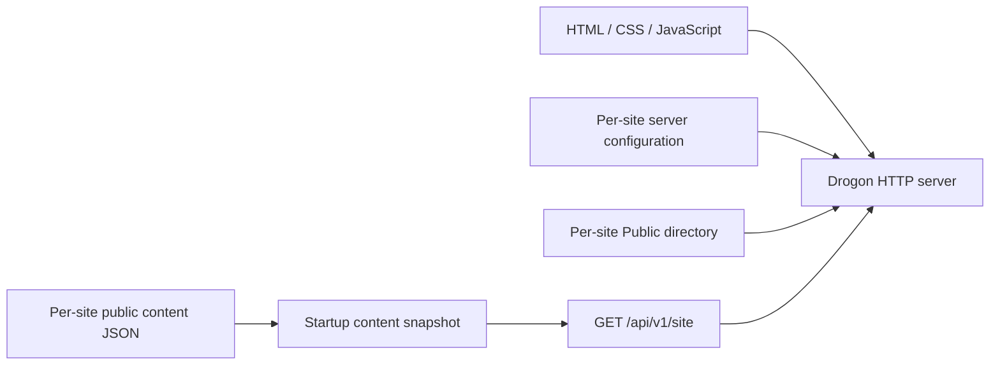

# Aloha Massage example

A first migration example for [alohamassage.bg](https://www.alohamassage.bg/),
using the existing studio branding and photographs with plain HTML, CSS and
vanilla JavaScript. It has a homepage, massage menu, about/team page, training
page, gift-voucher page, booking information page and contact links, in Bulgarian
and English. Page images, social icons, styles and Lora font files are stored
locally in this example. Shared account scripts are served from the repository
root’s `Admin` directory. Browsing these pages does not fetch assets,
widgets, reviews or content from the original website or a CDN.

This is a standalone public presentation, not a complete WordPress migration.
It retains the existing Fresha booking destination and links voucher purchases
to the existing website. The optional accounts configuration also provides a
separate local booking demo. Payments and contact-message storage are not implemented.

**Optional admin login and user profiles are now implemented.** See
[the accounts guide](../../Docs/ACCOUNTS.md) for the separate configuration, local
launcher and first-administrator setup. `Scripts/run.sh` defaults to the full
application; the separate public-only configuration and Python preview remain
available. The optional [service editor](../../Docs/CONTENT_EDITOR.md)
now provides forms for service translations, prices and availability with immediate
publishing. Optional [customer email and newsletters](../../Docs/CUSTOMER_EMAIL.md)
now add registration, recovery, email verification and subscriber-only campaigns.
The example writes to a private local outbox for testing; no real email is sent.
Resend delivery and verified delivery callbacks are available through explicit
configuration; see the [domain and hosting setup guide](../../Docs/CUSTOMER_EMAIL.md#going-live-starting-without-a-domain-or-hosting).
The example enables 24-hour appointment reminders in the local outbox.
Optional [native reservations](../../Docs/RESERVATIONS.md) now provide customer
bookings/history and a staff day/week agenda. Statistics, external calendar
integration and automatically emailed printable vouchers after payment remain
future work, described in [NEXT_FEATURES.md](NEXT_FEATURES.md).

## Quick setup and operation

Run commands from the repository root:

```sh
./Scripts/build.sh
./Scripts/run.sh
```

On a fresh machine, run `./Scripts/install-deps.sh --dry-run` to review apt
prerequisites, then `./Scripts/install-deps.sh` to install them. Follow any remaining
Drogon installation instructions it reports; Felis must already be populated in
`Dependencies/FelisFramework`. The build script enables accounts, content editing
and reservations. It preserves this checkout's existing build cache and extracted
PostgreSQL setup. No frontend build is needed. See the root
[development commands](../../README.md#development-commands) for options and
[ACCOUNTS.md](../../Docs/ACCOUNTS.md) for manual configuration.

Keep the launcher terminal open. It starts private PostgreSQL, applies the account
migrations (including reservations) and runs the C++ backend. Run only one launcher for this example. Ctrl+C
stops the processes it started and preserves their data; restarting does not reset
accounts. Back up before applying a new migration to valuable data.

Create the first administrator in another terminal, substituting your own email:

```sh
./Scripts/run.sh bootstrap your@email.com
```

Enter/repeat a 15–128-character password at the hidden prompt. Bootstrap is allowed
only before an administrator exists. Later administrators are created through the
admin panel. Local password recovery for an existing account is:

```sh
./Scripts/run.sh reset-password your@email.com
```

| Task | Where/how |
| --- | --- |
| View the full local example | [Website](http://127.0.0.1:8082/?lang=bg) |
| Edit services and manage users | [Admin](http://127.0.0.1:8082/admin?lang=bg); sign in as admin and select a section in the sticky navigation ribbon |
| Edit name/phone/language, password and email preferences | [Profile](http://127.0.0.1:8082/profile?lang=bg) |
| Register a customer | [Registration](http://127.0.0.1:8082/email?action=register&lang=bg) |
| Test verification/recovery/subscription links | Open the newest matching private `Runtime/Email/*.json` and follow its `text` link |
| Inspect email delivery and failures | [Email delivery](http://127.0.0.1:8082/admin?lang=bg#section-mail) |
| Test a newsletter | Confirm subscription, then use the admin newsletter preview/queue controls; output stays in `Runtime/Email` |
| Sign in from the public site | Use **Вход / Sign in** in the header; profile/reservation/staff links appear after login |
| Book a demo appointment | Verify your email, then [My reservations](http://127.0.0.1:8082/profile?lang=bg#section-reservations), expand the booking form, select a service/date and find a time |
| Manage appointments | Admins/operators use [Reservations](http://127.0.0.1:8082/admin?lang=bg#section-reservations) for a day/week agenda and guest bookings |
| Change other page text or pictures | Stop the backend, edit `Content/site.json` / `Public/assets`, then restart |

The **Users / Потребители** section has name/email search, role/access filters,
sorting by creation date, last login or email, and pages of 25 accounts. Press
**Apply filters / Приложете филтрите** after choosing filters. Each row has role/access
controls; the expandable creation form is above the table. **My profile / Моят профил**
contains your personal settings. Only the selected section is shown, and switching
sections preserves drafts. The ribbon and status message stay visible while scrolling.
Restart the launcher after updating: it applies account migrations through version
4 and reservation migrations through version 2 while preserving existing accounts
and sessions. No database reset is needed.

Use `lang=en` for English. Service saves publish immediately and create private
content backups. Refresh the public page to see the result. The editor currently
covers services, translations, durations, prices and availability; general page,
image-upload and statistics editors are not implemented. Email verification is
required for recovery/subscription, but not for administrator content editing.
Native reservations currently use one demo therapist and one demo room, and enable
relaxation/deep-tissue services. See [reservation setup and operation](../../Docs/RESERVATIONS.md)
for schedules, verification, cancellation policy and limitations. They are separate
from Fresha. Live email activation needs a domain, Resend and HTTPS hosting;
social login and paid PDF vouchers remain future
work; the original external booking/checkout options remain available.

The public-only C++ configuration uses port 8080; Python preview uses 8090.
Use **8082** for accounts/admin tests. For backups, disk estimates and a fresh test
database, see [database operation](../../Docs/ACCOUNTS.md#disk-backups-and-a-fresh-test-database).

## Reusable code and site-specific files

| Location at repository root | Responsibility |
| --- | --- |
| `Dependencies/FelisFramework` | General C++ foundation |
| `Source`, `Migrations`, `Admin` | Reusable server modules, database schema and shared admin/account UI |
| `Config`, `Docs`, `CMakeLists.txt` | Base configuration, documentation and build integration |
| `Examples/AlohaMassage/Config`, `Content`, `Public` | Aloha deployment settings, translated content and public frontend/assets |
| `Examples/AlohaMassage/Runtime/Accounts` | Local PostgreSQL cluster, socket and database log |
| `Examples/AlohaMassage/Runtime/Email` | Private test email messages |
| `Examples/AlohaMassage/Runtime/ContentBackups` | Private content revisions |
| `Examples/AlohaMassage/accounts_dev.py`, `preview.py` | Aloha development launchers |
| `Scripts` | Dependency installation, builds, convenient launcher commands and tests |

Content edits live in `Content/site.json`, not PostgreSQL. Database backups alone
therefore do not back up the editable website. Runtime directories and private
backup archives are excluded by the root `.gitignore` and must also stay outside
public hosting. Ignore rules do not remove files already tracked in version control.

There is no Aloha-specific C++ module. Admin/account presentation comes from
`accounts.ui` in the site configuration; the shared scripts and emails use neutral
defaults. See [admin reuse](../../Docs/ACCOUNTS.md#reusing-the-administration-interface)
for configuration and module extension. Integration tests include both Aloha
fixtures and a separately configured generic business/database. A second site needs its own
configuration, content/frontend, runtime paths, database credentials and process,
with a different port/origin. Merely copying the example without changing those
settings would still point it at the Aloha database.

## Preview without building C++

From the repository root:

```sh
./Scripts/run.sh preview
```

Open <http://127.0.0.1:8090/>. Stop the preview with Ctrl+C. Use `--port=8091`
if needed. Python 3's standard library is sufficient; no packages are installed.

This loopback-only helper serves `Public` and maps `/api/v1/site` to the example's
content document. It exists only to preview the frontend while the Felis build
environment is unavailable. It is not a production server or a substitute C++
implementation. The C++ backend is now also built and verified on this machine;
the helper remains useful for frontend-only work. It reloads the content document on each request; the C++ backend
loads it at startup and updates its snapshot when the service editor publishes.
It does not implement `/health` or the C++ loader's
size/depth/duplicate-key validation. Directory listings are disabled.

Do not open `index.html` using `file://`: the frontend fetches content over HTTP.
The page shows a retry message if the content request fails; it does not silently
replace an API failure with a second source of data.

## Use the reusable backend

For the public-only C++ website, build and run:

```sh
./Scripts/build.sh --public-only
./Scripts/run.sh public
```

Open <http://127.0.0.1:8080/>. This configuration selects:

| Setting | Location relative to `Config/server.json` |
| --- | --- |
| Static document root | `../Public` |
| Public content JSON | `../Content/site.json` |
| Temporary request-body storage | `../Runtime/Uploads` |

The server configuration and content source stay outside the static document
root. Only the deliberately selected content document is exposed by the API.
There is no Aloha-specific C++ class, executable, compilation flag or dependency.
Another website can use the same binary with another configuration, frontend
and content file. Separate simultaneous processes need distinct listening ports
and writable runtime directories.



Felis remains the general C++ foundation. HTTP concerns stay in the reusable
backend; business presentation and content stay in this example.

## Edit the website

- `Content/site.json`: contact details, translated page copy, services, durations,
  prices, categories, promotions, team, gallery and presentation settings.
- `Public/index.html`: page structure with neutral loading/error/no-JavaScript text.
- `Public/styles.css`: layout, typography, colours and responsive rules.
- `Public/site.js`: page rendering, menu search/filtering, translation switching
  and the content API request.
- `Admin/public-account.js` (at repository root): reusable public login dialog,
  identity display and role-aware profile/administration links.
- `Public/assets`: original studio artwork, photographs, icons and local fonts.
- `Config/server.json`: deployment settings, including the public content file.
- `asset-sources.json`: original URLs for imported assets and the font license.

Use the admin service editor for routine menu changes. For manual content changes,
stop the C++ process, edit JSON and restart; for the local Python preview, edit and
reload the browser. No frontend bundler or build step is needed.
Business information is no longer duplicated in HTML or JavaScript. Before the
content loads, or if the first load fails, the page shows a neutral message. Without
JavaScript it shows an enable-JavaScript notice, rather than a static Aloha page.
Generating a complete HTML fallback from the same JSON is a possible later step.

The optional `presentation` object configures `images` (`logo`, `ornament`, `hero`,
`pageHeader`, `sectionBackground`, `footerBackground`), `featuredImage`, `voucherImage`,
`socialLinks`, `languageNames` and `formatLocales`. Image URLs must be local `/assets/`
paths. Each social link has an `id`, `label` and optional `icon`; its destination
comes from `business.social[id]`. Without presentation settings, decorative images
and header social links are omitted and featured pictures fall back to the gallery.
Layout, colours and font styling remain in this example's stylesheet.

Booking-provider labels use `translations[locale].externalBooking` (the old `fresha`
key remains a compatibility fallback). The local calendar invitation uses
`nativeBookingTitle`, `nativeBookingText` and `nativeBookingAction` in the same
translation dictionary. Public navigation lists the other configured `locales`;
omitting `lang` selects `defaultLocale`. To add a content language, supply its page
dictionary and localized entries, optionally setting its display name and number
format locale under `presentation`. Account-interface translations are independent
and currently support English and Bulgarian.

The document's `schemaVersion` remains `1`. This example configures `bg` and `en`:

```json
{
  "title": { "bg": "Релакс масаж", "en": "Relaxation massage" },
  "variants": [
    { "durationMinutes": 60, "priceMinor": 5500, "currency": "EUR" }
  ]
}
```

Money is stored in integer minor units: `5500` means EUR 55.00. A `null` price
means “price on booking”. These are display prices, not trusted checkout totals.
The external booking/purchase service supplies actual availability and ordering
terms. Do not implement charging or discounts from browser-provided prices.

Give services unique stable IDs and a category matching `categories[].id`. Each
service has a title, description, variants and an HTTPS or telephone booking URL.
An empty `variants` array means duration and price need consultation. Setting
`available` to `false` displays an unavailable label and removes its booking action.
`courses`, `voucherOptions`, `voucherDetails` and `bookingDetails` supply the
corresponding local pages. Prices of vouchers and courses also use integer minor
units, with `null` for a price that must be confirmed.
Localized content falls back to `defaultLocale`; UI translation dictionaries
should contain the same keys. Dynamic text uses `textContent`, not HTML injection.
Images must be hosted beneath `/assets/`. The content document is entirely public:
never add credentials, private customer details, appointment history or internal
notes to it.

Promotions have an inclusive `startsAt` and exclusive `endsAt`, including explicit
UTC offsets. The frontend displays active offers using the visitor's clock. This
is presentation logic only; future eligibility, redemption and discount rules
must be checked by the backend. The copied summer offer stops displaying at
midnight on 1 October 2026 in Sofia.

Routes use `/?page=menu&lang=en` (also `home`, `about`, `training`, `vouchers`, `booking`),
so every page works without rewrite rules. Changing languages preserves the page.
This is intentionally not a migration of the old WordPress URLs. Before replacing
the live site, add permanent redirects, dedicated indexable language/page URLs,
canonical metadata and a sitemap. `noindex, nofollow` is currently set on the
example to keep an accidental preview deployment out of search results.

## Content provenance and migration decisions

The reference site was inspected on 8–9 September 2026:

- [Homepage](https://www.alohamassage.bg/): visual structure, branding and gallery.
- [Massage menu](https://www.alohamassage.bg/sofia/massages/): service names, durations,
  clearly listed EUR prices and Fresha links, including its dynamically loaded menu.
- [Studio information](https://www.alohamassage.bg/sofia/): address and contact details.
- [About us](https://www.alohamassage.bg/za-nas/): portraits and team biographies.
- [Training](https://www.alohamassage.bg/kurs-po-masaj/): training page and enquiry destination.
- [Vouchers](https://www.alohamassage.bg/ваучер-за-масаж/): existing purchase destination.

Opening hours are **every day, 11:00–20:00**, explicitly confirmed by the user
during this task because the original pages disagreed about Sunday opening.

The expanded menu contains 28 service entries, including the unavailable Tibetan
LIGHT treatment. Some source sections disagree on prices, notably SPA relaxation,
facial treatments and older combinations. These use “price on booking”; uncertain
durations/programmes use a consultation instead of an invented option. The local
menu no longer depends on the original menu widget. It does not reproduce every
package, add-on or historical promotion. Retained prices still need the family's
review before replacing the live site. No currency conversion has been invented.

The voucher page separately lists the source's two gift offers (SPA relaxation
75 minutes/EUR 60 and Lomi Lomi 80 minutes/EUR 70). It links each offer to its real
existing product checkout and explains delivery and the listed two-month validity.
The expired Christmas discount is not copied. Courses include the basic EUR 800
classical course and home-massage enquiries; conflicting home-course prices and
dated enrolment announcements have not been imported.

Bulgarian descriptions have been shortened and English copy supplied for this
example. The gallery/logo/backgrounds, team portraits and social icons come from
the existing site; no WordPress theme code, widgets or tracking scripts are bundled.
Lora Latin and Cyrillic fonts (weights 400/500) are served locally under the included
`Public/assets/Lora-OFL.txt` license, with system serif fallbacks. Imported image
assets retain their existing ownership/licensing;
they are studio-specific, not assets for unrelated businesses using this backend.

The original contact form is represented by direct phone and WhatsApp links.
Google reviews link to the real Google Maps listing; reviews are not fabricated
or stored locally. Vouchers and bookings continue on the existing external
services. Nothing is submitted automatically when the example is viewed.

“Standalone” means the public pages and their assets work without the original
site being available, provided this example is served over HTTP. Fresha booking,
existing-shop checkout, Google Maps/reviews, social networks and messengers still
require their respective services when the visitor follows those links. There is
no embedded third-party calendar, payment form, map, tracker or live review widget.
Do not disable the old checkout or Fresha until replacements are implemented.

## Verification and next steps

JavaScript syntax, JSON/translation consistency, referenced assets and configured
paths were checked while creating this example. The C++ application has since
been built and smoke-tested with `FELIS_USE_STD_FORMAT=OFF`, using this example's
configuration and content. Health, content, static files, concurrent requests,
configuration isolation, error handling and shutdown checks passed. See the root
README for the commands and full validation summary. On 9 September 2026 these
HTTP smoke checks passed again with the expanded content. All 20 bundled images
and font files were retrieved from the C++ server and matched their local bytes;
fonts were served with `application/font-woff2`. The 28 service IDs, both translation
dictionaries, six page titles and asset provenance were also checked. On 10 September
2026 browser checks covered public login in both languages, customer booking,
staff agenda/rescheduling and mobile header clearance using disposable accounts.
This is not an exhaustive visual review of every public page.

For browser review, check both languages and every page on desktop and mobile;
exercise menu filters, empty search results, expandable prices and API failure/retry.
Confirm external booking, voucher and contact destinations before going live.

The [next-feature design](NEXT_FEATURES.md) describes persisted content with authenticated editing and
an audit trail. Account profiles, native reservations and booking history are
available through optional modules. Loyalty rewards and calendar-provider adapters
remain future work. Publishing the site and replacing the current domain are separate steps.
